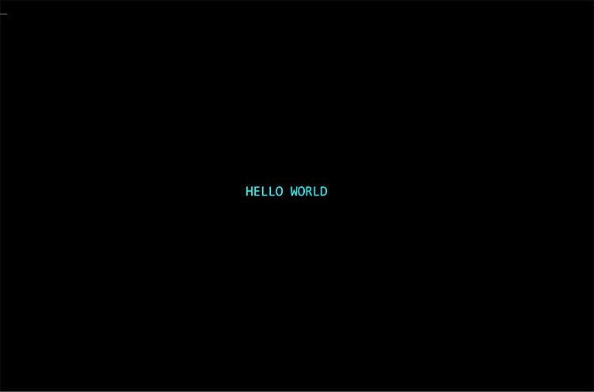

# Hello World on KICKS

The goal here is to create a step by step document for getting a "Hello 
World" program up and running. The KICKS and Tur(n)key documentation is 
outstanding, but it ends up being a bit fragmented if you're trying to go 
soup to nuts with "Hello World".

The canonical documentation for KICKS is here: http://www.kicksfortso.com/
You'll want to refer to this often to fill in any gaps in understanding.

### Install Hercules and the Tur(n)key System TK5

I won't go into depth on how to get Hercules and TK up and running. 
There are great written resources here:

https://www.jaymoseley.com/hercules/

https://www.prince-webdesign.nl/index.php/software/mvs-3-8j-turnkey-5

I'll note a YouTube channel that I absolutely love: https://www.youtube.com/@moshixmainframechannel

Moshix puts out great stuff and this channel has been essential during my 
education on MVS based stuff.  His video specifically on installing Hercules 
on Windows is here: https://www.youtube.com/watch?v=QTxe8ASdxE0


### Install KICKS

I also won't go into depth on this.  However Moshix's video on installing 
KICKS was all I needed to get going.  I just followed along and everything 
worked perfectly: https://www.youtube.com/watch?v=u_ZSH9OagTM

### Aliasing KICKS (Optional)

In case you don't feel like typing `EXEC KICKSSYS.V1R5M0.CLIST(KICKS)` from 
the TSO prompt to launch KICKS,
you can copy the CLIST member to `<userid>.CMDPROC` where `<userid>` is 
something like `HERC01`.

```
-----------------------------  MOVE/COPY UTILITY  -----------------------------
Command ===> C

                                C - COPY DATA SET OR MEMBERS(S)                 
FROM TSO LIBRARY:              M - MOVE DATA SET OR MEMBERS(S)                 
PROJECT ===>                                                          
LIBRARY ===>                                                           
TYPE    ===>                                                         
MEMBER  ===>              (BLANK FOR MEMBER LIST, * FOR ALL MEMBERS)

FROM OTHER DATA SET:                                                           
DATA SET NAME ===> 'HERC01.KICKSSYS.V1R5M0.CLIST(KICKS)'                     
VOLUME SERIAL ===>               REPLACE MEMBERS ? N     DISP=MOD ? N       `
```

```
-----------------------------  MOVE/COPY UTILITY  -----------------------------
Command ===>                                                                   
                                                                               
                FROM: 'HERC01.KICKSSYS.V1R5M0.CLIST(KICKS)'                    
TO TSO LIBRARY:                                                                
   PROJECT ===>                                                          
   LIBRARY ===>                                                           
   TYPE    ===>                                                          
   MEMBER  ===>                                                                
                                                                               
TO OTHER DATA SET:                                                             
   DATA SET NAME ===> 'HERC01.CMDPROC(KICKS)'                                  
   VOLUME SERIAL ===>                                                          
```

Now you can simply type `KICKS` at the TSO prompt to launch KICKS.

### Implement Hello World in BMS and COBOL

I created two PDS's to hold all my KICKS stuff.
You can organize your data however you want but I allocated `HERC01.KICKS.JCL` for jobs and `HERC01.KICKS.CBL` for 
COBOL. 

I'm using http://www.kicksfortso.com/User's%20Guide%201.5.0/KooKbooK/01/index.htm as a starting point for this 
exercise but I made a few different choices as I went.  Again, feel free to modify names and organization as you see 
fit. The recipe uses the name "test" as a namespace basis but I went ahead and used "hello world" as my naming theme.  

The first thing we'll do is create the BMS map.  I took the recipe's advice and simply embedded the BMS code 
directly in the JCL named `HELLOMAP`:

```
//HERC01KM JOB (1),'KICKS MAP',                                                 
//         CLASS=A,                                                             
//         MSGCLASS=X,                                                          
//         REGION=8M,                                                           
//         MSGLEVEL=(1,1)                                                       
//JOBPROC DD DSN=HERC01.KICKSSYS.V1R5M0.PROCLIB,DISP=SHR                        
//         EXEC KIKMAPS,MAPNAME=HELLOSET                                        
//COPY.SYSUT1 DD *                                                              
HELLOSET  KIKMSD MODE=OUT,CTRL=FREEKB                                           
HELLOWLD  KIKMDI SIZE=(24,80)                                                   
          KIKMDF POS=(12,33),LENGTH=11,INITIAL='HELLO WORLD'                  
          KIKMSD TYPE=FINAL                                                     
          END                                                                   
/*                                                                              
```

Submitting this job will create two members: `HERC01.KICKS.V1R5M0.KIKRPL(HELLOSET)`
and `HERC01.KICKS.V1R5M0.COBCOPY(HELLOSET)`.  `HERC01.KICKS.V1R5M0.KIKRPL(HELLOSET)` is the binary physical map used 
by KICKS to display the interface.  `HERC01.KICKS.V1R5M0.COBCOPY(HELLOSET)` is the COBOL copybook that will be 
imported into your custom COBOL program.  The copybook should look something like this:

```
      *///////////////////////////////////////////////////////////////          
      * 'BMS' map for use with 'KICKS for TSO'                                  
      *   generated 10/02/23 at 18:23:42 with mapgen version V1R5M0(0)          
      *                                                                         
      * 'KICKS for TSO'                                                         
      * 4 Copyright 2008-2014, Michael Noel, All Rights Reserved.               
      *                                                                         
      * Assuming the input belongs to you this generated map is also            
      * your property and you may do whatever you like with it.                 
      *   HOWEVER                                                               
      *                                                                         
      * Usage of 'KICKS for TSO' is subject to license.                         
      * See http://www.kicksfortso.com                                          
      * for most current information regarding licensing options,               
      *//1/////////2/////////3/////////4/////////5/////////6/////////7          
                                                                                
       01  HELLOWLDO.                                                           
           02  FILLER PIC X(12).                                                
                                                                                
```

Now let's create some COBOL in a data set named `HELLOWLD` to exercise this map.

```
       IDENTIFICATION DIVISION.                                                 
       PROGRAM-ID. HELLOWLD.                                                    
       DATA DIVISION.                                                           
       WORKING-STORAGE SECTION.                                                 
       COPY HELLOSET.                                                           
       PROCEDURE DIVISION.                                                      
                                                                                
           EXEC CICS                                                            
              SEND MAP ('HELLOWLD') MAPSET ('HELLOSET') ERASE                   
           END-EXEC.                                                            
                                                                                
           EXEC CICS                                                            
              RETURN                                                            
           END-EXEC.                                                            
```

Notice that we copy in the `HELLOSET` copybook that was just generated.  At this point we simply send the map back.

Now let's create the JCL to compile the file.

```
//HERC01KC JOB (1),'KICKS COMPILE',                                             
//         CLASS=A,                                                             
//         MSGCLASS=X,                                                          
//         REGION=8M,                                                           
//         MSGLEVEL=(1,1)                                                       
//JOBPROC DD DSN=HERC01.KICKSSYS.V1R5M0.PROCLIB,DISP=SHR                        
//         EXEC K2KCOBCL                                                        
//COPY.SYSUT1 DD DSN=HERC01.KICKS.CBL(HELLOWLD)                                 
//LKED.SYSIN DD *                                                               
 INCLUDE SKIKLOAD(KIKCOBGL)                                                     
 ENTRY HELLOWLD                                                                 
 NAME HELLOWLD(R)                                                               
```

Submit this job.  The binary data will end up in `<userid>.KICKS.V1R5M0.KIKRPL(HELLOWLD)`. 

### Setting up the PPT and PCT

Using http://www.kicksfortso.com/User's%20Guide%201.5.0/Configuration.htm as a reference, we create our own 
copy of the 2 JCL files that generate the PPT and PCT.  KICKS uses 2-letter suffixes to define a namespace around 
the tables and the JCL that generates those tables.  The default 2-letter suffix is '1$'.  Rather than edit the 
original default data sets and risk screwing them up, I created my own copies with the suffix 'AA'.  Then I reconfigure 
the system to look at the 'AA' data sets rather than the default '1$'.  This allows me to have a playground that I 
can always revert back to the original if I need to.

Copy `<userid>.KICKSSYS.V1R5M0.INSTLIB(KIKPPT1$)` to `<userid>.KICKSSYS.V1R5M0.INSTLIB(KIKPPTAA)`.  You'll edit 2 lines.

```
         KIKPPT TYPE=INITIAL,SUFFIX=1$
```

becomes

```
         KIKPPT TYPE=INITIAL,SUFFIX=AA
```

and about the 3rd line from the bottom

```
//SYSLMOD  DD DSN=HERC01.KICKSSYS.V1R5M0.SKIKLOAD(KIKPPT1$),DISP=SHR
```

becomes

```
//SYSLMOD  DD DSN=HERC01.KICKSSYS.V1R5M0.SKIKLOAD(KIKPPTAA),DISP=SHR
```

You'll also need to add an entry for your hello world program near the bottom of the PPT entries listing

```
         KIKPPT TYPE=ENTRY,PROGRAM=HELLOSET,USAGE=MAP
         KIKPPT TYPE=ENTRY,PROGRAM=HELLOWLD,PGMLANG=CMDLVL
```

The process for the PCT is very similar.  Copy `<userid>.KICKSSYS.V1R5M0.INSTLIB(KIKPCT1$)` to `<userid>.KICKSSYS.
V1R5M0.INSTLIB(KIKPCTAA)`.  You'll edit 2 lines.

```
         KIKPCT TYPE=INITIAL,SUFFIX=1$
```

becomes

```
         KIKPCT TYPE=INITIAL,SUFFIX=AA
```

and about the 3rd line from the bottom

```
//SYSLMOD  DD DSN=HERC01.KICKSSYS.V1R5M0.SKIKLOAD(KIKPCT1$),DISP=SHR
```

becomes

```
//SYSLMOD  DD DSN=HERC01.KICKSSYS.V1R5M0.SKIKLOAD(KIKPCTAA),DISP=SHR
```

You'll also need to add an entry for the transaction mapping of your program in the PCT entries listing.  I chose 
`HWLD` as my transaction id.

```
         KIKPCT TYPE=ENTRY,TRANSID=HWLD,PROGRAM=HELLOWLD
```

### Submit

Save these edits and then submit both jobs.  The jobs create a PPT and the PCT.  Once the job completes, the 
resulting tables will be sitting in `<userid>.KICKSSYS.V1R5M0.SKIKLOAD`.  Now there will be 2 sets of these tables, 
the original `1$` tables and your customized `AA` tables.

### Run KICKS and Transaction

Exit ISPF out to a TSO prompt.  Run

```
KICKS PPT(AA) PCT(AA)
```

The PPT and PCT options are important.  They override the default `1$` tables and utilize the `AA` tables.  Omitting 
them will not bind the `HWLD` tranid to your program.  Once you run the above, launch your program by entering 
`HWLD` and you should see the following:

